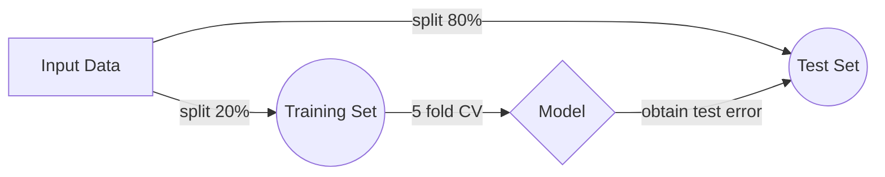

##  Drug Sensitivity Prediction Challenge :smile: ##

1.1 Program call

1.2 without arguments

2.1 Classificator description

2.2 Regressor description :smiley:

# 1.1 Program call: 
> This project contains two programs, one **classificator** and one **regressor**
> Start this programs with Rscript and the following arguments :

 - ``` $ ./Rscript Classificator.R <gene expression> <drug> <training set 80%> <test set 20%>``` 
 - ``` $ ./Rscript Regressor.R <gene expression> <drug> <training set 80%> <test set 20%>```

|                |Argument                          |Value                         |
|----------------|-------------------------------|-----------------------------|
|1          |`<gene expression>`   |'Your genes'            |
|2          |`<drug>`              |"Funny drugs :pill::see_no_evil:"            |
|3          |`<training set 80%>`  |"Isn't this fun?"   
|4          |`<test set 20%>`      |"Yes, this is fun!"   

 - Output:
 
 -- Test-File
 
 -- Training-File
 
 -- Error-File





# 1.2 Without Arguments: 
> For Testing, call this program without arguments:
``` $ ./Rscript Classificator.R ```  or
``` $ ./Rscript Regressor.R ``` 
> The files will search in the folder \data


# 2.1 Classificator
> coming soon :eyes:


# 2.2 Regressor
> coming soon
